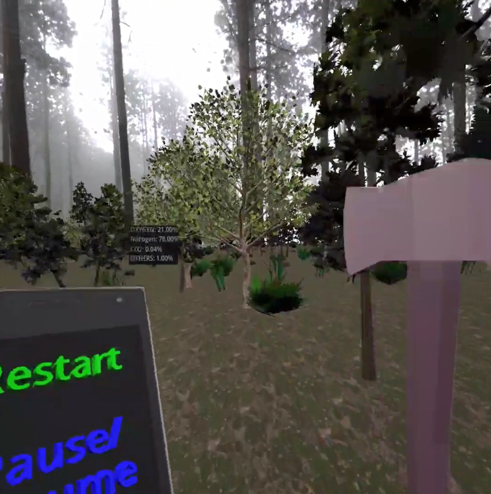

# 🌲 EchoChop – A VR Tree Chopping Simulation

**EchoChop** is a virtual reality (VR) simulation game built with the [Godot Engine] where players chop down trees using motion-based interactions. Designed for Oculus Quest 2 and powered by OpenXR, the game immerses you in a dynamic forest environment with realistic physics, sound effects, and environmental feedback.

---
## 🎥 Gameplay Demo

#### ▶️ Click below to watch the gameplay video.

[](./gameplay.mp4)
---

## 🎮 Gameplay Overview

- Use motion-tracked VR controllers to swing your axe.
- Chop down trees that respond with dynamic falling physics.
- Environmental gas levels update in real time: O₂ drops, CO₂ rises.
- Interactive HUD shows real-time atmospheric changes.
- Navigate and interact with the world using intuitive hand gestures and controller input.

---

## 🚀 Features

- ✅ Fully integrated VR controls (Oculus Quest 2 via OpenXR)
- 🌲 Realistic tree-chopping mechanics using physics
- ⚙️ Axe toggling and controller-based raycasting
- 📊 Dynamic HUD for oxygen, nitrogen, CO₂, and others
- 🧠 Menu system with laser-based VR UI (Start, Pause, Quit)
- 📱 Android-ready APK export for standalone deployment

---

## 🧱 Built With

| Tool/Tech                        | Purpose                         |
| -------------------------------- | ------------------------------- |
| **Godot Engine**           | Game engine and scene logic     |
| **GDScript**               | Scripting interactions          |
| **OpenXR**                 | VR support and controller input |
| **Blender** *(optional)* | Tree/controller models          |
| **Audacity/Freesound**     | Audio design                    |

---

## 🎮 Controls (Oculus Quest 2)

| **Control**                                   | **Functionality**             |
| --------------------------------------------------- | ----------------------------------- |
| **Right Controller – B**                     | Menu Selection                      |
| **Right Controller – A**                     | Toggle Raycast Laser / Activate Axe |
| **Left Trigger**                              | Teleport                            |
| **Left Trigger + Trackpad**                   | Change Teleport Direction           |
| **Right Trigger + Hand Swing**                | Walk in Place                       |
| **Right Joypad**                              | Controlled Walking                  |
| **Right Joypad + Right Trigger + Hand Swing** | Sprint                              |
| **Left Grip Click**                           | Recenter View                       |

---

## 🛠 How It Was Built

EchoChop was built using the Godot Engine with XR support for Oculus Quest 2. Key highlights:

- **Scene-Based Architecture:** Each tree and UI element is a modular scene.
- **Motion-Based Movement:** Player locomotion is triggered by natural hand swinging and joystick control.
- **Axe Mechanics:** A raycast-based axe system detects tree hits and converts tree parts into physics objects.
- **HUD Integration:** SubViewport-based 3D HUD displays environmental data in real-time.
- **Environment Feedback:** Chopping trees dynamically affects oxygen, nitrogen, and CO₂ levels.
- **VR Menus:** Interactive laser-pointer-based menu with 3D buttons for Start, Pause, and Quit.
- **Quest 2 Deployment:** Final version exported as an APK and tested on standalone VR hardware.

---

## 🧪 How to Run

1. **Clone the Repository**

   ```bash
   git clone https://github.com/yourusername/echochop.git
   ```
2. **Open in Godot Engine**

   - Use **Godot 4.x** (or the version you developed with).
   - Launch Godot and select the `Eco-Chop` folder from the project list.
   - Run the project — this will start with `Start.tscn` (menu), then transition to the main scene.
3. **VR Setup**

   - Enable **OpenXR** in Project Settings.
   - Ensure Oculus Quest 2 is connected or install the APK via `adb`.
4. **Play!**

   - Put on your headset and enjoy chopping trees in VR!

---

## 🧠 Future Ideas

- Tree types with different properties
- Crafting and wood collection system
- Enhanced sound reverb and ambient music
- Wildlife or dynamic weather system
- Multiplayer co-op tree chopping!

---

## 📄 License

This project is licensed under the [MIT License](LICENSE).
